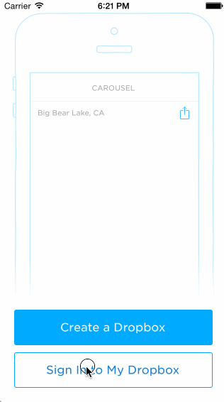

Carousel Flow
============

###Description###

Homework assignment for week 2, iOS Bootcamp for Designers. Had a lot of trouble with this assignment. Mostly related to time management and prioritization, but also had several huge crashes in Xcode. The final of which broke everything, tried making a new project and copying in the old files but that didn't work. Uploaded assignment contains all the (working) code and I managed to complete the gif before everything broke. It should also be noted that hoydb helped me by providing some of the code as commented in the source, this because we are on the same team and I needed help completing it in time (which I still didn't haha). 

###Time Spent###

~10hrs. Terrible time management on my part. Should've started much sooner, lots of problems with xcode/yosemite. I will rectify this for the following assignments. 

###Completed Stories###

#####Required#####
Tapping on email/password reveals the keyboard and shifts the scrollview and Sign In button up.
User sees an error alert when no email is present or no password is present.
User sees a loading screen upon tapping the Sign In button.
User sees an error alert when entering the wrong email/password combination.
User is taken to the tutorial screens upon entering the correct email/password combination.

User can page between the screens

Display a scrollable view of images.
User can tap on the conversations button to see the conversations screen (push).
User can tap on the profile image to see the settings view (modal from below).

User can dismiss the settings screen.
User can log out

####Optional####
None.

###Walkthrough###

